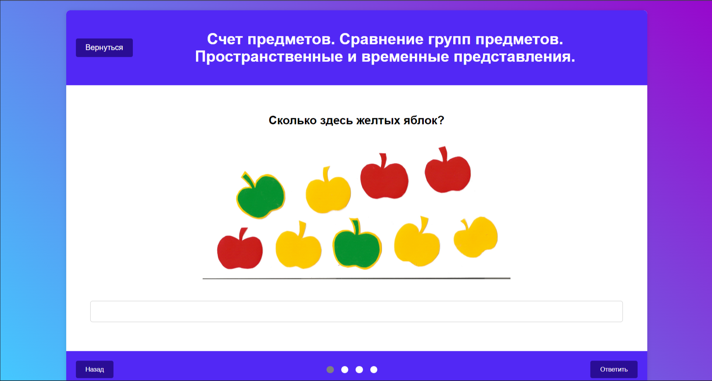
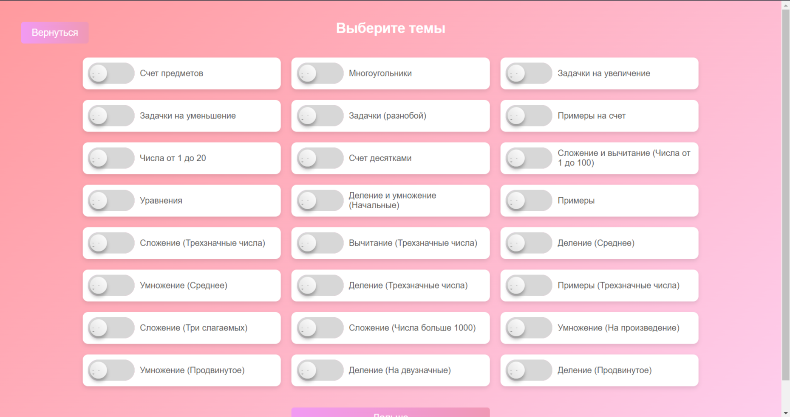
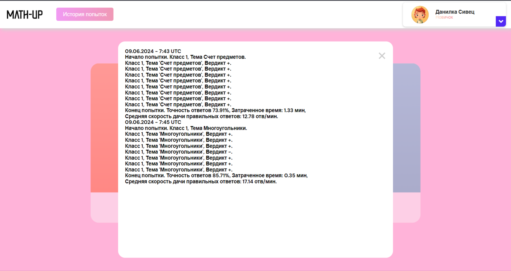
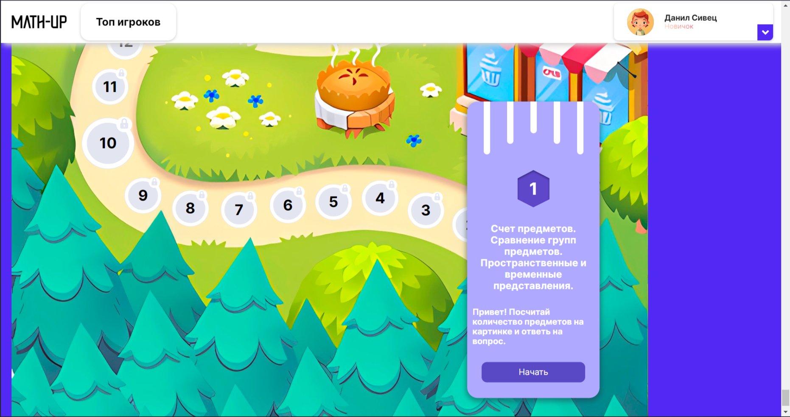
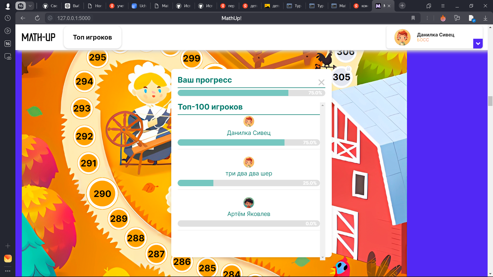

# MathUP!


MathUp - это удобная образовательная платформа, созданная для школьников ***1-4 классов***, 
которым хочется изучать ***математику*** в игровой форме или просто потренироваться в необходимых темах.


Наша платформа доступна по адресу https://math-up.ru.

Также у нас есть мобильно приложение, которое находится в папке apk.

Проект был создан для участия в отборочном этапе II Всероссийского хакатона "Обучаюсь. Проектирую. Программирую. Будущее": Направления "Программирование". Здесь представлена чистовая версия, основной репозиторий, в котором велись работы https://github.com/staflix/MathSphere.git.

Данная платформа поддерживает любые разрешения экранов, полностью масштабируема.

---
## Как запустить локально (не рекомендуется)

Если вы не имеете доступа к сети, вы можете запустить сервер локально (предварительно загрузив проект).

1. Установить Python 3.9

2. Требования к установке
```pip install -r requirements.txt```

3. Запустить веб-сервер локально запустив код в main.py

4. Перейти к [http://127.0.0.1:5000](http://127.0.0.1:5000)

---
## Пример использования сайта


Наш сайт корректно работает на всех устройствах, независимо от размеров экрана.

Вход в наш продукт можно совершить при помощи почты и пароля, или используя Ваш Яндекс аккаунт. Наш сайт использует cookie-файлы для максимально удобного использования.


На данной платформы представлены два режима использования, о которых написано подробнее ниже.

---
## Как выглядит задание?



В задании Вы можете увидеть:
1. Тему задания
2. Текст задачи
3. Поле для ответа
4. Выбор из вариантов ответов (не на всех уровнях)
5. Кнопку ответить (чтобы проверить правильность ответа)
6. Оповещение о правильности/неправильности ответа
7. Кнопку далее (для перехода к следующему заданию)
8Кнопку завершить (для выхода)

В зависимости от выбранного Вами режима на экранах могут появляться разные вариации уровней.


---
## Тренажёр

Он создан для тех, кто хочет улучшить свои способности в определённых темах. Также тренажёр поможет определить Ваши сильные и слабые стороны, что очень полезно при саморазвитии.

Здесь Вам представится выбор из 4ех классов, в каждом из которых содержится 6 тем.


* 1 класс
    + Счет предметов
    + Многоугольники
    + Задачки на увеличение
    + Задачки на уменьшение
    + Задачки (разнобой)
    + Примеры на счет
* 2 класс 
    + Числа от 1 до 20
    + Счет десятками
    + Сложение и вычитание (Числа от 1 до 100)
    + Уравнения
    + Деление и умножение (Начальные)
    + Примеры
* 3 класс 
    + Сложение (Трехзначные числа)
    + Вычитание (Трехзначные числа)
    + Деление (Среднее)
    + Умножение (Среднее)
    + Деление (Трехзначные числа)
    + Примеры (Трехзначные числа)
* 4 класс 
    + Сложение (Три слагаемых)
    + Сложение (Числа больше 1000)
    + Умножение (На произведение)
    + Умножение (Продвинутое)
    + Деление (На двузначные)
    + Делание (Продвинутое)

Также есть отдельная вкладка "Микс", в которой можно самому выбрать набор разных тем, которые Вы хотели бы отточить.



Также в тренажере вы можете увидеть историю ваших попыток, нажав на кнопку "История попыток".




---
## Кампания



Интересный формат обучения, охватывающего сразу все темы. Здесь встретятся задания на все темы тренажера в порядке школьной программы.
Вы начинаете свой путь с 1 класса -- 1 уровня, а заканчиваете на 400 уровне -- конце 4 класса.

Вам необязательно проходить все уровни, если вы уже проходили эти темы. Всегда можно подтвердить уровень Ваших знаний прохождением любого из трёх тестов.
+ 100 уровень - конец первого класса.
+ 200 уровень - конец второго класса.
+ 300 уровень - конец третьего класса.

Эти уровни доступны Вам всегда, после их прохождения все прошлые уровни откроются.

### Мотивация

В кампании есть топ 100 самых успешных игроков, проходите уровни усердно и Вы увидите себя в топе среди лучших!

За прохождение каждого класса Вам выдается титул, проходите контрольные, чтобы увидеть их все!



---

## Безопасность продукта

> ### Уязвимость: SQL-инъекции
>> **Решение:** Мы используем библиотеку SQLAlchemy, которая автоматически обрабатывает запросы и защищает от SQL-инъекций. Все запросы к базе данных проходят валидацию с помощью ORM, что предотвращает возможность выполнения вредоносных SQL-запросов.

> ### Уязвимость: XSS 
>> **Решение:** Мы настроили заголовки безопасности в Nginx, включая Content Security Policy (CSP) и X-XSS-Protection, чтобы предотвратить выполнение вредоносных скриптов. Также все данные, вводимые пользователями, проверяются и экранируются перед выводом на страницу.

> ### Уязвимость: Необработанные исключения
>> **Решение:** Мы реализовали обработчик ошибок, который обрабатывает все исключения, логирует их и возвращает пользователю дружественные сообщения без раскрытия внутренней информации.

>### Уязвимость: DDoS атаки
>> **Решение:** Мы настроили ограничение скорости запросов (rate limiting) в Nginx для предотвращения DDoS-атак. Это ограничивает количество запросов, которые может отправлять один клиент за определенный промежуток времени.

>### Уязвимость: Небезопасные конфигурации Docker
>> **Решение:** Мы запускаем контейнеры от имени непривилегированного пользователя, регулярно обновляем Docker-образы и минимизируем права доступа контейнеров. Используем только проверенные официальные образы Docker. 

>### Уязвимость: Отсутствие шифрования трафика
>>**Решение:** Мы настроили HTTPS с использованием SSL-сертификата, чтобы обеспечить шифрование трафика. Регулярно обновляем сертификаты безопасности и используем сильные шифровальные алгоритмы для защиты данных.

